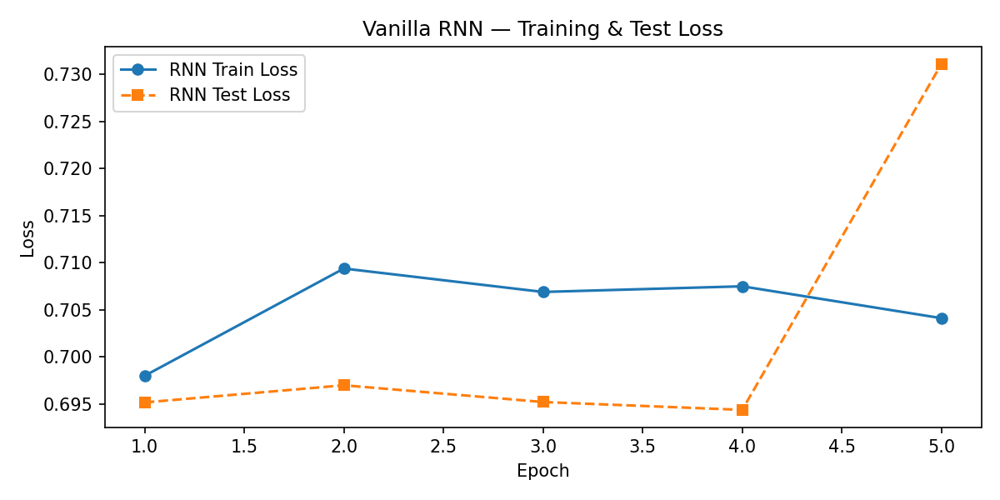
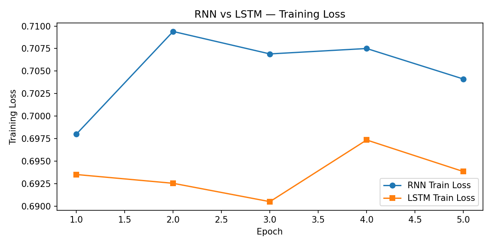
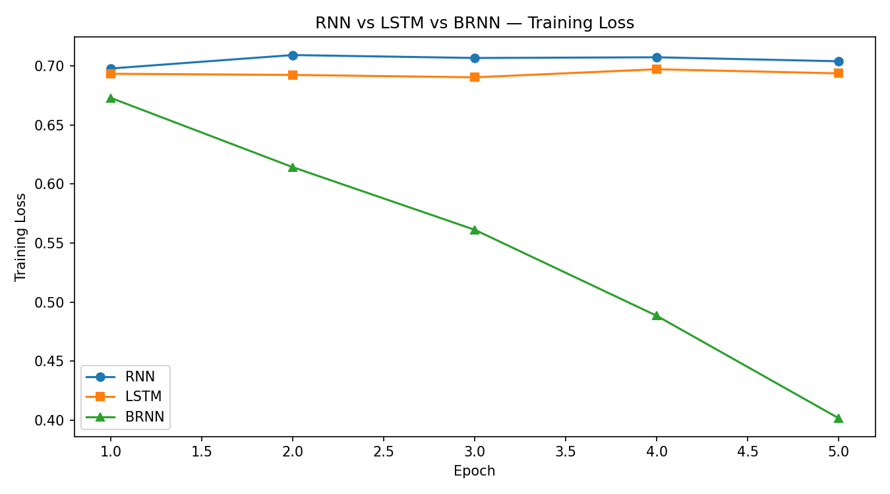

# RNN, LSTM and Bidirectional LSTM Sentiment Analysis

A deep learning project comparing recurrent neural network architectures for sentiment classification on the IMDb movie review dataset.

This project evaluates the performance of a Vanilla RNN, LSTM, and Bidirectional LSTM (BRNN) under identical training conditions to investigate how architectural choices impact learning, accuracy, and computational cost.

## Overview

Natural Language Processing (NLP) tasks require models capable of understanding sequential information. Recurrent Neural Networks are designed for this purpose, but different recurrent architectures handle long-range dependencies with varying levels of success.

This project implements and compares:

- Vanilla RNN
- Long Short-Term Memory Network (LSTM)
- Bidirectional LSTM (BRNN)

Each model predicts whether an IMDb movie review expresses positive or negative sentiment.

## Dataset

IMDb Movie Review Dataset

- 25,000 training reviews
- 25,000 test reviews
- Binary sentiment classification
- Reviews truncated to 500 tokens
- Vocabulary limited to the 20,000 most frequent words

## Technologies Used

- Python
- PyTorch
- HuggingFace Datasets
- NumPy
- Matplotlib
- Jupyter Notebook

## Model Architectures

### Vanilla RNN

A single-layer recurrent neural network using the final hidden state for classification.

### LSTM

A two-layer Long Short-Term Memory network with dropout regularisation designed to mitigate the vanishing gradient problem.

### Bidirectional LSTM (BRNN)

A two-layer bidirectional LSTM that processes text in both forward and backward directions, allowing the model to utilise contextual information from the entire sequence.

## Experimental Setup

All models were trained using:

- Adam Optimiser
- Learning Rate: 0.001
- Batch Size: 64
- Gradient Clipping (max_norm = 1.0)
- 5 Training Epochs
- Cross-Entropy Loss

Identical training conditions were used to ensure fair comparison between architectures.

## Results

| Model | Test Accuracy | Parameters | Avg Epoch Time |
|---------|---------|---------|---------|
| Vanilla RNN | 50.12% | 2.66M | 3.6s |
| LSTM | 50.00% | 3.48M | 25.0s |
| BRNN | 84.94% | 4.93M | 54.9s |

## Training Curves

### Vanilla RNN



### RNN vs LSTM



### RNN vs LSTM vs BRNN



## Key Findings

### Vanilla RNN

- Failed to learn meaningful sentiment patterns.
- Training loss remained approximately constant across all epochs.
- Achieved performance close to random guessing.

### LSTM

- Introduced memory cells and gating mechanisms.
- Despite increased complexity, achieved similar performance to the Vanilla RNN.
- Demonstrated the importance of implementation details and sequence handling.

### BRNN

- Achieved 84.94% test accuracy.
- Consistently reduced training loss throughout training.
- Significantly outperformed both unidirectional architectures.
- Demonstrated the advantages of bidirectional context in sentiment analysis tasks.

## Discussion

The most notable outcome was the substantial performance gap between the BRNN and the two unidirectional models.

While both the Vanilla RNN and LSTM achieved approximately random classification performance, the BRNN successfully learned meaningful sentiment representations and reached nearly 85% test accuracy.

The results suggest that access to contextual information from both directions of a sequence can significantly improve sentiment classification performance.

The project also highlights the trade-off between computational cost and predictive performance, with the BRNN requiring the longest training time while delivering the strongest results.

## Learning Outcomes

This project provided practical experience with:

- Natural Language Processing (NLP)
- Sequence Modelling
- Recurrent Neural Networks
- Long Short-Term Memory Networks
- Bidirectional Recurrent Architectures
- Text Preprocessing
- Model Evaluation
- Comparative Deep Learning Experiments

## Repository Structure

```text
rnn-sentiment-analysis/
│
├── README.md
├── RNN_Assignment.ipynb
├── Assignment_2_report_RNN.docx
├── rnn_loss.png
├── rnn_vs_lstm_loss.png
├── all_models_loss.png
└── requirements.txt
```

## Author

**Kieran Ward**

Computer Science Student | Cybersecurity & AI Enthusiast

GitHub: https://github.com/KieranWard491
